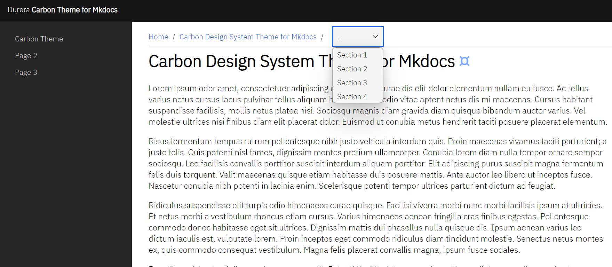
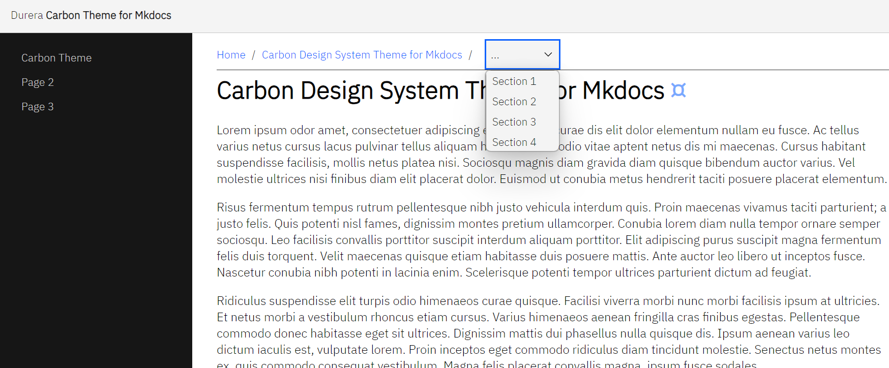
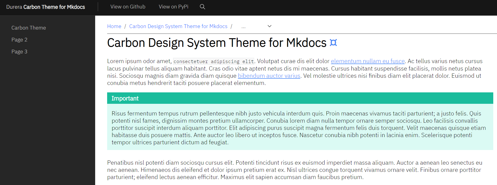

mkdocs-carbon
===============================================================================
[](https://pypi.org/project/mkdocs-carbon/)
[](https://pypi.org/project/mkdocs-carbon/)
[](https://pepy.tech/project/mkdocs-carbon)

[Carbon Design System](https://github.com/carbon-design-system/carbon) theme for [mkdocs](https://github.com/mkdocs/mkdocs).

Very much in beta state right now, contributions welcomed.

- `v1.3` Support for Accordion component & edit link in header
- `v1.2` Support for Header Navigation Menu
- `v1.1` Support for Search
- `v1.0` Initial Release


Examples
-------------------------------------------------------------------------------
- [IBM Maximo Application Suite CLI Documentation](https://ibm-mas.github.io/cli/)


Installation
-------------------------------------------------------------------------------

```bash
python -m pip install mkdocs-carbon
```


Usage
-------------------------------------------------------------------------------
```yaml
theme:
  name: carbon
  prefix: Durera
  theme_header: g100
  theme_sidenav: g90
  header_nav_items:
    - title: View on Github
      url: https://github.com/durera/mkdocs-carbon
      active: true
    - title: View on PyPi
      url: https://pypi.org/project/mkdocs-carbon/
      target: _new

markdown_extensions:
  - toc:
      permalink: "¤"
```


Theme Configuration
-------------------------------------------------------------------------------
### Prefix
The default `prefix` is **Carbon**, this is what appears before the **Site Title** in the header

### Carbon Theme Selection
Easily switch between Carbon themes using `theme_sidenav` and `theme_header`, they can be set to `white`, `g10`, `g90`, or `g100`, by default the header uses **g100**, and the side navigation **g90**.




### Header Navigation Menu
The header navigation menu can be enabled by defining `header_nav_items` as a list of objects with `url` and `title`.  Optionally control where the links open using `target`, or set a navigation item as active by adding `active` set to `true`.




Optional Page Metadata
-------------------------------------------------------------------------------
### Additional Breadcrumb Entries
The following metdata are supported, when set they will extend the breadcrumbs built from the nav structure by adding up to two extra entries before the final entry in the breadcrumb:

- `extra_breadcrumb_title_1`
- `extra_breadcrumb_url_1`
- `extra_breadcrumb_title_2`
- `extra_breadcrumb_url_2`

It's possible to only set the title for one or both of the entries if you don't want the breadcrumb element to take the user anywhere.

### Associate Orphaned Page with Nav
An orphaned page can be connected to the navigation structure by setting the `nav_title` metadata to the title of the navigation item it should be connected to.


Fonts
-------------------------------------------------------------------------------
Fonts are packaged in the theme itself:

- [IBM Plex Sans (Light)](https://fonts.google.com/specimen/IBM+Plex+Sans)
- [IBM Plex Mono (Light)](https://fonts.google.com/specimen/IBM+Plex+Mono)


Supported Carbon Components
-------------------------------------------------------------------------------
These can be introduced as HTML inside markdown documents to bring Carbon components to your content.

### Breadcrumb
```html
<cds-breadcrumb no-trailing-slash>
  <cds-breadcrumb-item>
    <cds-breadcrumb-link href="{{ nav.homepage.url | url }}">Home</cds-breadcrumb-link>
  </cds-breadcrumb-item>
</cds-breadcrumb>
```

### Select
```html
<cds-select id="breadcrumbs-toc" class="cds-theme-zone-g10" inline placeholder="..." oninput="changeAnchor(this.value)">
  
  
    <cds-select-item value="{{ toc_item.url }}">{{ toc_item.title }}</cds-select-item>
  
</cds-select>
```

### Tabs
```html
<cds-tabs trigger-content="Select an item" value="2024">
  <cds-tab id="tab-2024" target="panel-2024" value="2024">2024 Catalogs</cds-tab>
  <cds-tab id="tab-2023" target="panel-2023" value="2023">2023 Catalogs</cds-tab>
  <cds-tab id="tab-2022" target="panel-2022" value="2022">2022 Catalogs</cds-tab>
</cds-tabs>

<div class="tab-panel">
  <div id="panel-2024" role="tabpanel" aria-labelledby="tab-2024" hidden>
    Tab 1 content here
  </div>
  <div id="panel-2023" role="tabpanel" aria-labelledby="tab-2023" hidden>
    Tab 2 content here
  </div>
  <div id="panel-2022" role="tabpanel" aria-labelledby="tab-2022" hidden>
    Tab 3c ontent here
  </div>
</div>
```

### Search

```html
<cds-search id="header-search" label-text="Search" cds-search-input="search-event" expandable></cds-search>
```

## Accordion
When using the accordion component, make sure to enclose the accordion object inside a div, otherwise mkdocs will mess up the generated HTML.

```html
<div>
<cds-accordion>
  <cds-accordion-item title="Section 1 title">
    <p>Lorem ipsum odor amet, consectetuer adipiscing elit. Torquent sapien natoque volutpat lobortis mollis diam. Dictumst nibh tristique aliquet blandit suspendisse maecenas commodo class. Maecenas tincidunt ultrices elementum etiam ipsum at. Blandit habitasse ultricies dapibus volutpat eu porttitor pharetra? Posuere velit maecenas blandit praesent semper donec tristique natoque. Sapien sapien lobortis neque praesent morbi hendrerit. Diam arcu adipiscing himenaeos accumsan cras. Viverra pulvinar sodales torquent habitasse amet penatibus gravida.</p>
  </cds-accordion-item>
  <cds-accordion-item title="Section 2 title">
    <p>Lectus dui ridiculus mauris tempus; vivamus dignissim accumsan montes. Donec taciti vitae tincidunt faucibus hac mattis ante pretium. Taciti eros metus sapien urna eleifend ridiculus sagittis. Ridiculus conubia ligula parturient ullamcorper condimentum posuere porttitor. Dignissim urna laoreet conubia cubilia scelerisque cubilia aliquet inceptos aliquam. Senectus ultricies posuere eu facilisis pulvinar dignissim.</p>
  </cds-accordion-item>
  <cds-accordion-item title="Section 3 title">
    <p>Integer interdum at praesent congue semper maecenas platea. Bibendum facilisis eros potenti et egestas potenti curabitur. Mi blandit lacus aptent nullam, eros sagittis rhoncus vestibulum. Litora sapien ultricies vivamus facilisi varius erat ut. Luctus pretium massa dis cursus fusce purus montes molestie facilisi. Cras non mi suspendisse lobortis habitant sem malesuada feugiat est. Blandit natoque commodo sem eget curae porta facilisis sociosqu.</p>
  </cds-accordion-item>
</cds-accordion>
</div>
```
